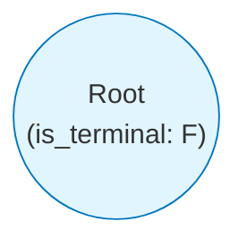
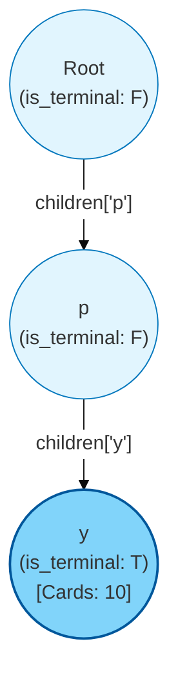
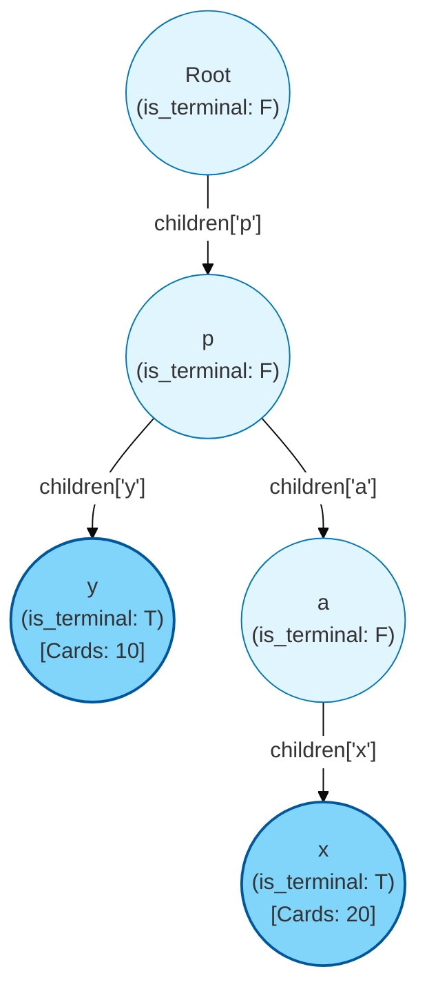
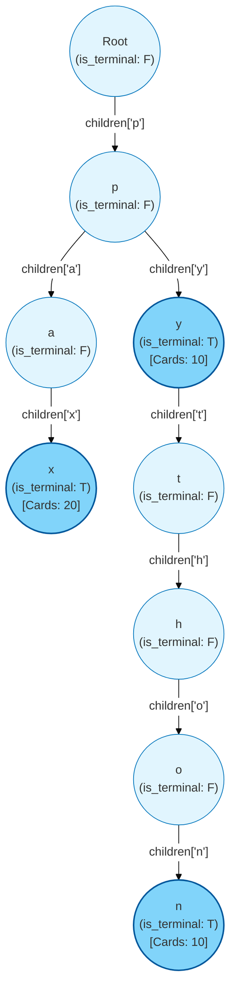
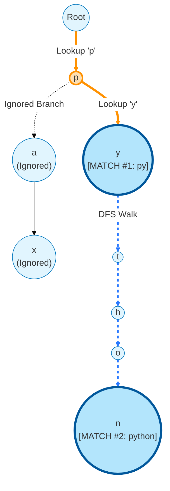

A companion to [Shipping sm2-flashcards](). The Trie in `app/trie.py` is the project's headline data structure, but how it actually evolves in memory during inserts — and how `search_prefix` walks it — isn't obvious from the code alone.

These diagrams trace the exact sequence of `_TrieNode` allocations and child-pointer updates as three tags get inserted, then visualize the two-phase prefix search.

## Step 1: Initialize the empty Trie

Before any data is inserted, the Trie consists of only a single, blank root node. It has no children, no associated card IDs, and is not a terminal node.



## Step 2: Insert "py" with Card 10

When `insert("py", 10)` is called, the Trie creates a new path.

1. It creates a node for `'p'`.
2. It creates a node for `'y'`, marks it terminal, and adds Card 10.



## Step 3: Insert "pax" with Card 20

Next, `insert("pax", 20)`. The Trie follows the existing `'p'` branch and splits to a new `'a'` branch.

1. Follows Root → `p`.
2. Creates a new branch for `'a'`.
3. Creates a node for `'x'`, marks it terminal, and adds Card 20.



## Step 4: Insert "python" with Card 10

Finally, `insert("python", 10)`. This tag reuses the entire existing path of `"py"`.

1. Follows Root → `p` → `y`.
2. Continues the path, creating new nodes for `'t'`, `'h'`, `'o'`, `'n'`.
3. Marks `'n'` terminal and adds Card 10.



## Step 5: Visualizing `search_prefix("py")`

This is how autocomplete executes on the final structure above.

The search happens in two phases, highlighted in different colors:

1. **Prefix lookup (`_find`)** — travels down the orange arrows to find the node representing `"py"`. The `'a'` branch (and the entire `"pax"` subtree) is never touched.
2. **Collection walk (`_walk`)** — starting from the `y` node, DFS collects every terminal node in that subtree (the blue path). Returns both `"py"` and `"python"`.



## Two takeaways

1. **Shared prefixes share memory.** Inserting `"python"` reuses the entire `p → y` path from `"py"`. That's why the trie is `O(total characters across all keys)`, not `O(num_keys × avg_key_length)`. Insert a thousand variants of `"graph-*"` and you only pay once for the `"graph-"` prefix.
2. **Search is two phases, not one.** The prefix lookup is a tight `O(k)` walk down the trie. The collection phase is `O(r)` where `r` is the number of matching nodes underneath. Branches that don't share the prefix are pruned entirely from the work — you never even look at them. That's the asymptotic difference vs. a naive `for word in vocab: if word.startswith(prefix)` scan.

This is what `tests/bench_trie.py` measures in the project — Trie prefix search vs. the naive scan on a 5,000-tag corpus. The Trie wins by an order of magnitude on this size and the gap widens as the corpus grows.

<!-- Mermaid renderer: convert fenced ```mermaid blocks into <div class="mermaid"> and initialize. -->
<script src="https://cdn.jsdelivr.net/npm/mermaid@10/dist/mermaid.min.js"></script>
<script>
  document.querySelectorAll('pre > code.language-mermaid').forEach(function (el) {
    var div = document.createElement('div');
    div.className = 'mermaid';
    div.textContent = el.textContent;
    el.parentElement.replaceWith(div);
  });
  mermaid.initialize({ startOnLoad: true, theme: 'base' });
</script>
